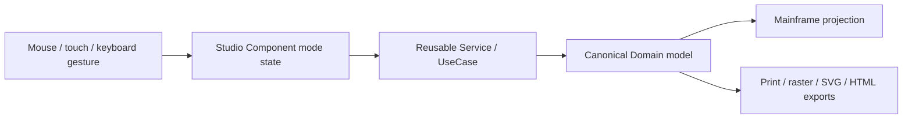

# Media and picture gesture editing

## Video Studio

The timeline is a sequence of `PublicationMediaSegment` values inside one video element. Selecting, splitting, merging, deleting, copying, pasting and replacing a selected section are non-destructive mutations of that sequence. The frame-region mode stores normalized polygon coordinates (`0..1`) so any video dimensions and angled polygon can be projected consistently.

## Audio Studio

Audio uses the same temporal sequence operations and explicit timeline modes. It intentionally has no two-dimensional frame-region mode because its editable dimension is time.

## Picture Studio

Area-selection tools create a document-coordinate overlay. Rectangle and ellipse selections are converted to polygons; freehand, magnetic and polygon modes retain their vertices. A layer may keep the polygon or invert it as a non-destructive cut-out. Copying a region stores a clipped layer in the existing Picture Studio clipboard, so normal paste creates an independently editable layer.

## Mainframe and Z-order contract

Studios return canonical result contracts. `Editor.razor` and `EditorStateService` apply them to the selected element or create one new element. Internal media sections and selection overlays never become page siblings. Existing placement, Z-index, grouping, connector, animation and interaction state remains untouched when editing content.

Keyboard handlers are scoped to the active modal root. Window/document listeners and pointer capture are removed on cancellation, disposal and browser interruption.

## Coordinate and asset ownership

Temporal positions are seconds in the canonical media sequence. Video frame points are normalized source coordinates, independent of source width/height and publication rotation. Picture clip points are document coordinates and may describe any polygon angle. Audio never receives a two-dimensional region contract.

When the Mainframe applies an edited sequence, it removes asset-cache entries for sections no longer present and registers each surviving section by its canonical segment identifier. A transient Studio preview URL is not promoted to a canonical media asset unless it represents the same source.
