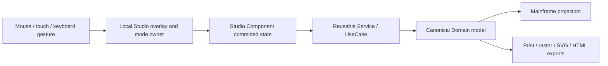

# Media and picture gesture editing

## Input ownership

Each pointer sequence has one owner. In normal playback the native media element owns its controls. In a spatial selection mode a local Studio overlay is placed above the media content, blocks the player, and owns pointer/touch input until apply or cancel. Timeline modes own only the timeline. The Mainframe never participates while a modal Studio is active.

High-frequency pointer movement is rendered locally in JavaScript and CSS. Blazor Server receives committed polygon points, range changes and commands rather than every mouse move. Keyboard handlers are scoped to the active modal root. DOM listeners, `ResizeObserver` instances and pointer capture are released on rebind, cancellation and disposal.

## Video Studio

The timeline is a sequence of `PublicationMediaSegment` values inside one video element. Selecting, splitting, merging, deleting, copying, pasting and replacing a selected section are non-destructive mutations of that sequence.

Frame-region mode creates a local overlay aligned to the actual rendered video rectangle after `object-fit: contain`; letterbox bars are not treated as source pixels. The rest of the preview is darkened, a local crosshair indicates the active selection cursor, and the native video controls are intentionally unavailable until the mode is applied or cancelled. Region vertices are stored as normalized source coordinates (`0..1`), so arbitrary source dimensions and angled polygons project consistently.

The preview shows the full source while editing. The committed clip is reapplied only after leaving region mode, preventing the editor from hiding the area that is still being selected.

## Audio Studio

Audio uses the same temporal sequence operations and explicit timeline modes. It intentionally has no two-dimensional frame-region mode because its editable dimension is time. Short or just-finalized recordings may be shorter than the normal UI step, so trim normalization derives a valid minimum span from the finite clip duration before any clamp operation.

## Picture Studio

Area-selection tools create a document-coordinate overlay. Entering a selection mode darkens the canvas and displays a local crosshair without creating a picture layer. During rectangle, ellipse, freehand, magnetic or polygon selection, the selected area remains visible while the outside is shaded and the selected boundary/nodes remain explicit.

Rectangle and ellipse selections are converted to polygons; freehand, magnetic and polygon modes retain their vertices. A layer may keep the polygon or invert it as a non-destructive cut-out. Copying a region stores a clipped layer in the existing Picture Studio clipboard, so normal paste creates an independently editable layer.

## Mainframe and Z-order contract

Studios return canonical result contracts. `Editor.razor` and `EditorStateService` apply them to the selected element or create one new element. Internal media sections and selection overlays never become page siblings or picture layers. Existing placement, Z-index, grouping, connector, animation and interaction state remains untouched when editing content.

Every editor overlay lives in a local positioned stacking context. Inactive overlays use `pointer-events: none`; active overlays capture only their declared gesture mode. Application-wide Z-index escalation is not a permitted fix for a local Studio interaction problem.

## Coordinate and asset ownership

Temporal positions are seconds in the canonical media sequence. Video frame points are normalized source coordinates, independent of source width/height and publication rotation. Picture clip points are document coordinates and may describe any polygon angle. Audio never receives a two-dimensional region contract.

When the Mainframe applies an edited sequence, it removes asset-cache entries for sections no longer present and registers each surviving section by its canonical segment identifier. A transient Studio preview URL is not promoted to a canonical media asset unless it represents the same source.

## Selected-clip temporal orchestration (v1.0.70)

Video Studio owns a source-time timestamp/range selector over the rendered video frame. Its bounds are the selected sequence segment's trim start/end. Browser JavaScript owns pointer movement and updates the handles, readouts, editable field projection and sequence highlight locally; Blazor receives a committed timestamp or range at gesture completion.

The temporal selection is intentionally separate from clip trim. It becomes canonical only through an explicit operation: a point adds a cutline, a range may add both boundaries, replace the selected clip trim, create a copied section, control range playback, or bound the insertion position for a dropped video. Source-to-sequence projection uses the selected segment's sequence start, source start and playback rate.

Video fit changes (`Contain`, `Cover`, `Stretch`) affect the rendered frame rectangle. Both temporal and spatial overlays must follow that rectangle after metadata, resize and fit changes. Native video controls are disabled inside Video Studio so fullscreen/player gestures cannot compete with Studio selection ownership.

## Full-canvas temporal and source-frame spatial ownership (v1.0.71)

Video Studio separates two coordinate systems. Temporal selection, playback scrubbing, cut placement, and media-drop insertion use the entire play canvas because time has no source-pixel X/Y boundary. The timestamp overlay therefore remains canvas-wide for `Stretch`, `Cover`, and `Contain`, including letterboxed regions. Its transport dock is fixed to the canvas bottom and its sequence projection uses the active segment's source start, timeline start, and playback rate.

Spatial frame-region editing still follows the rendered source-pixel rectangle. It is the only overlay allowed to cover temporal input, and only while `FrameRegion` mode is active. Outside that mode the frame overlay is visually hidden and pointer-transparent. This prevents its dim veil, help panel, and actions from leaking into normal playback.

The local layer order is: video surface, temporal overlay, mode HUD, active spatial overlay, pending insertion panel, then framework context menus. Drag/drop feedback is transient and projected through the temporal overlay. No layer changes publication Z-order or creates a canonical element.
