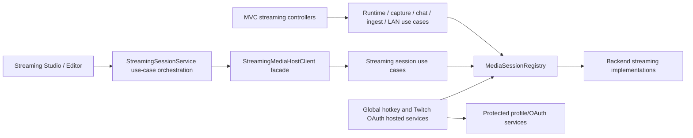
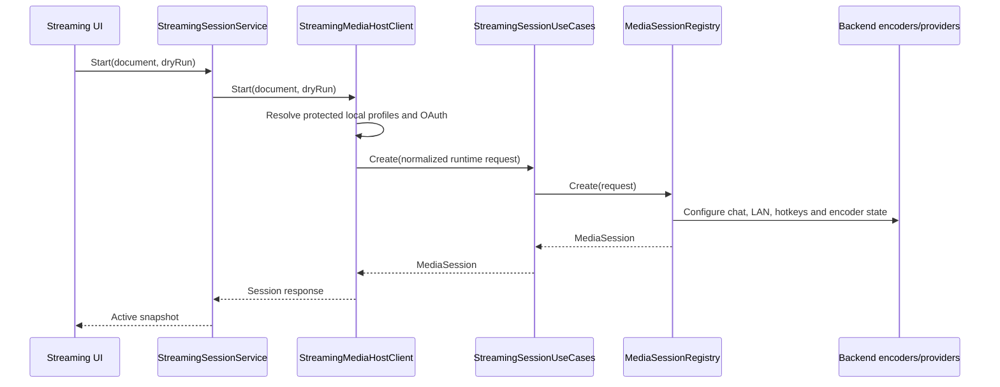
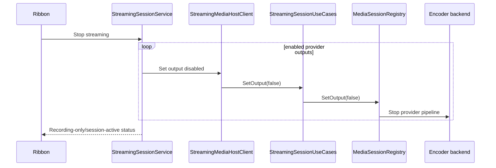

# Streaming architecture

Streaming remains part of `PublisherStudio.Web`; it is not a separately deployed Media Host.

## Component structure

## Main-host transport ownership

All `/api/mediahost`, `/stream` and `/watch` application routes are MVC controller actions under `Controllers/Streaming/UseCases`. The former `StreamingRuntimeEndpoints` aggregation no longer exists.

Controllers own HTTP status codes, model binding and WebSocket upgrade/close behavior. Services under `Services/Streaming/UseCases` own session lookup and operation ordering. Backend code owns FFmpeg, capture devices, chat providers, HLS/RTSP/WebRTC implementation and metadata parsing.

## Start session

## Stop provider streaming without stopping recording

## Complete stop

A complete stop cancels UI event polling, removes the session from the registry, unregisters global hotkeys, closes encoder input, completes ingest subscribers, disposes provider Chat, closes WebRTC peers and disposes LAN servers. Recording-only and provider-only stop operations remain separate.
