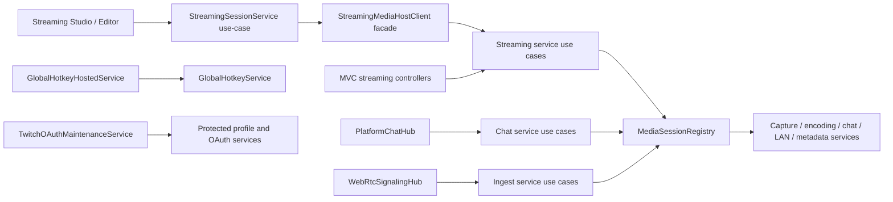
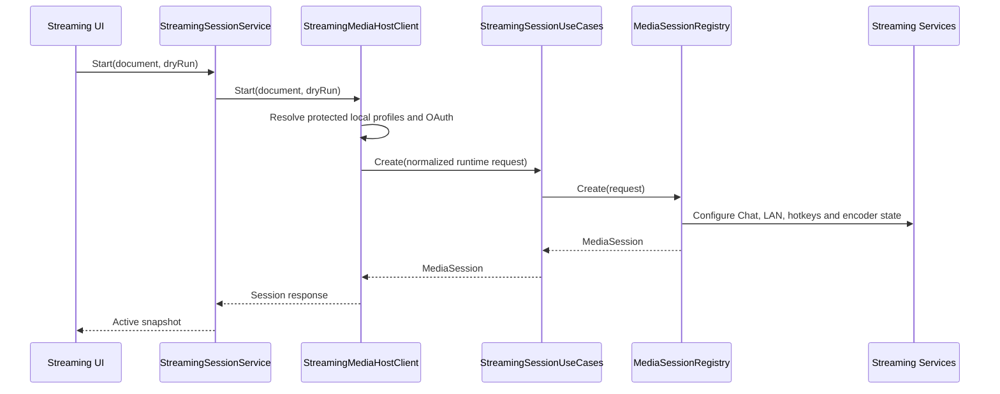

# Streaming architecture

Streaming remains part of `PublisherStudio.Web`; it is not a separately deployed Media Host and it has no separate `Backend` architectural root.

## Component structure

## Entry points and shared processing

All `/api/mediahost`, `/stream` and `/watch` main-application routes are MVC controller actions under `Controllers/Streaming/UseCases`. The former `StreamingRuntimeEndpoints` aggregation no longer exists.

Persistent Chat and WebRTC connection entry classes live under `Hubs/Streaming`:

- `PlatformChatHub` owns the platform-Chat WebSocket entry role.
- `WebRtcSignalingHub` owns the renderer-side WebRTC signaling entry role.

Controllers and Hubs own transport negotiation and connection lifecycle. Shared work is under `Services/Streaming`: session state, FFmpeg and encoder orchestration, native capture, provider Chat adapters, LAN/HLS/RTSP processing, WebRTC signaling state, metadata parsing, hotkeys, OAuth and protected stores.

Hosted services are lifecycle adapters. `GlobalHotkeyHostedService` starts and stops the reusable `GlobalHotkeyService`; `TwitchOAuthMaintenanceService` schedules validation through the reusable OAuth/profile Services. Services do not depend on HostedServices, Controllers, Hubs or Components.

## Start session

## Stop provider streaming without stopping recording

## Complete stop

A complete stop cancels UI event polling, removes the session from the registry, unregisters global hotkeys, closes encoder input, completes ingest subscribers, disposes provider Chat services, closes WebRTC peers and disposes LAN services. Recording-only and provider-only stop operations remain separate.
