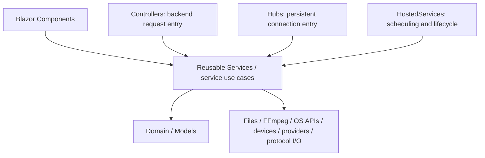

# System overview

PublisherStudio is a local-first Interactive Blazor Server monolith. The browser UI and the ASP.NET Core loopback host share one product lifecycle; InstallerConsole remains a deployment helper.

The diagram expresses responsibility and dependency, not a requirement that every operation traverse every box.

## Architectural roots

- **Components:** frontend state, display and user-command coordination.
- **Controllers:** normal HTTP/WebSocket request entry points; this is where the request-driven backend begins.
- **Hubs:** persistent connection entry points and connection lifecycle.
- **Services:** shared processing, orchestration, stores and technical I/O. Components, Controllers, Hubs and HostedServices reuse them.
- **Services/*/UseCases:** process coordination when a service area becomes large.
- **HostedServices:** thin application-lifetime scheduling, polling and start/stop adapters around Services.
- **Domain / Models:** authoritative documents, shared contracts and view models.

There is deliberately no separate `Backend` folder or namespace. Technical backend work belongs to the appropriate reusable Service subnamespace.

The enforceable repository contract is in [`AGENTS.md`](../../AGENTS.md). Architecture decisions are recorded in `docs/decisions`.
