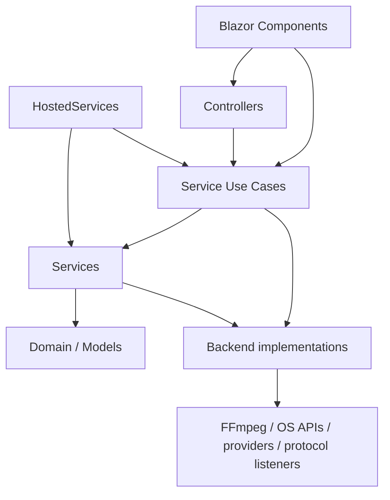

# System overview

PublisherStudio is a local-first Interactive Blazor Server monolith. The browser UI and the ASP.NET Core loopback host are one product lifecycle; the InstallerConsole remains a deployment helper.

The diagram expresses dependency and responsibility, not a requirement that every operation traverse every box.

## Architectural roots

- **Components:** UI state, display and user-command coordination.
- **Controllers:** HTTP and WebSocket transport entry points for the main host.
- **Services:** application capabilities, protected stores and orchestration.
- **Services/*/UseCases:** process/use-case coordination when a service area becomes large.
- **Backend:** technical media, provider, protocol and operating-system implementations.
- **HostedServices:** application-owned long-running loops and lifecycle work.
- **Domain / Models:** authoritative documents, shared contracts and view models.

The repository contract is in [`AGENTS.md`](../../AGENTS.md). Architecture decisions are recorded in `docs/decisions`.
