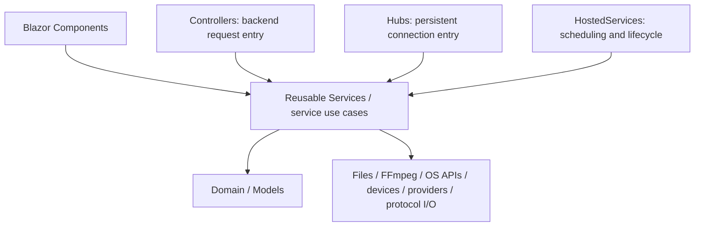

# System overview

PublisherStudio is a local-first Interactive Blazor Server monolith. The browser UI and the ASP.NET Core loopback host share one product lifecycle; InstallerConsole remains a deployment helper.

```mermaid
flowchart TD
    UI[Blazor Components] --> S[Reusable Services / service use cases]
    C[Controllers: backend request entry] --> S
    HB[Hubs: persistent connection entry] --> S
    HS[HostedServices: scheduling and lifecycle] --> S
    S --> D[Domain / Models]
    S --> X[Files / FFmpeg / OS APIs / devices / providers / protocol I/O]
```

The diagram expresses responsibility and dependency, not a requirement that every operation traverse every box.

## Architectural roots

- **Components:** frontend state, display and user-command coordination.
- **Controllers:** normal HTTP/WebSocket request entry points; this is where the request-driven backend begins.
- **Hubs:** persistent connection entry points and connection lifecycle.
- **Services:** shared processing, orchestration, stores and technical I/O. Components, Controllers, Hubs and HostedServices reuse them.
- **Services/*/UseCases:** process coordination when a service area becomes large.
- **HostedServices:** thin application-lifetime scheduling, polling and start/stop adapters around Services.
- **Domain / Models:** authoritative documents, shared contracts and view models.

There is deliberately no separate `Backend` folder or namespace. Technical backend work belongs to the appropriate reusable Service subnamespace.

## Shared contract ownership

A request, event, state or result that crosses architectural roots has one authoritative declaration under the existing `Domain` or `Models` owner. Components, Controllers, Hubs, Services and HostedServices consume that same type. Service facades do not create same-named copies of shared contracts merely to reshape an in-process call.

Provider-, protocol- or process-specific DTOs are boundary types and must have explicit boundary names. They are mapped once to the canonical contract and remain local to the adapter. Project-wide `GlobalUsings*.cs` files are treated as a single symbol scope; automated checks reject collisions between types visible through those imports and reject Services shadowing Domain/Models contracts.

The enforceable repository contract is in [`AGENTS.md`](../../AGENTS.md). Architecture decisions are recorded in `docs/decisions`.

## Compiler-visible boundaries

Folder and namespace names participate in C# name resolution. New subnamespace leaves must avoid simple names that collide with framework or project types visible from the same enclosing namespace. Existing compatibility collisions use a deliberate file-level alias or explicit `global::` qualification. Aliases are preferred inside interpolated strings because an unparenthesized `{global::...}` hole is parsed as a format expression. Composition-root files (`Program.cs` and service-collection extensions) explicitly import or qualify moved Services, Hubs and HostedServices; they do not rely on IDE caches or accidental global usings.

The `csharpCompilationSafety` contract scans DI registrations and namespace/type collisions. It supplements—but does not replace—a real compiler build.

## Interface-first local API layer (v1.0.85)

Application registrations are centralized in `PublisherStudioServiceCollectionExtensions`. New OpenSCAD, code editing, automation, screenshot, localization/path and render-export capabilities are public interfaces shared by components and controllers. Refer to the v1.0.85 architecture guides and task ledger for completed and deferred scope.
