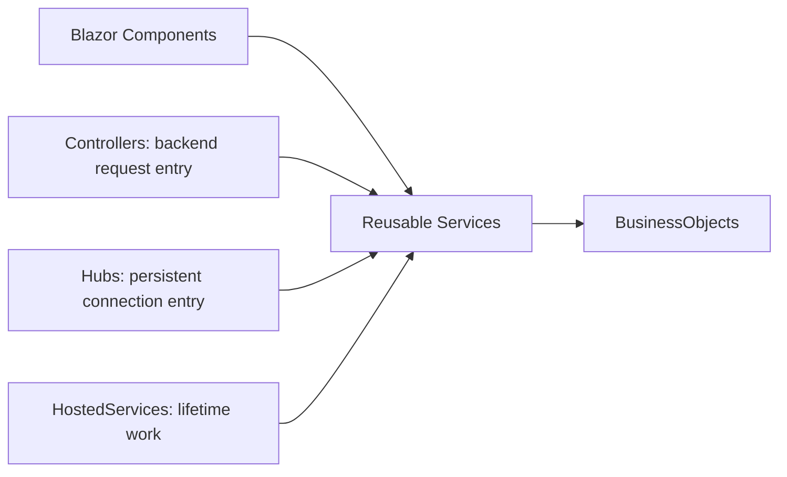

# Architecture

PublisherStudio is a dependency-injection-oriented modular monolith. The design keeps the application easy to ship while giving each responsibility one clear home. 🌸

## Main roots

- **Components** own UI state and user interaction.
- **Controllers** own backend HTTP request entry points and results.
- **Hubs** own persistent connection entry points.
- **HostedServices** own application-lifetime scheduling.
- **Services** own reusable processing, persistence, devices, files, networks, FFmpeg, and operating-system work.
- **BusinessObjects** own authoritative documents, requests, state, and result contracts.

Reusable work flows toward Services and BusinessObjects. Services do not depend on Components, Controllers, Hubs, or HostedServices. Specialized use cases stay in a `UseCases` subnamespace below their owning service area rather than becoming a competing application root.



## Service-owned behavior

`Program.cs` is the host composition root. Runtime state and reusable behavior belong to DI-owned services. PublisherStudio does not add application convenience statics to bypass composition.

P/Invoke and native exports belong behind injected lifetime services. Records, DTOs, constructors, and other BusinessObjects describe data; they do not acquire files, devices, networks, loggers, or host state.

## Canonical content

The native publication model is authoritative. External formats are adapters:

```text
external input → parse → temporary canonical model → validate → commit
canonical model → capability analysis → map → external output
```

Every semantic contract has one authoritative declaration. Service-local copies of BusinessObjects are not allowed.

## Browser boundary

C# owns canonical state. JavaScript owns high-frequency browser interaction and commits bounded results. Listeners, observers, object URLs, pointer capture, and media streams are released on rebind or disposal.

Editor interaction overlays live in a local positioned stacking context. They never change publication layer order, and a local editor problem is not solved with an application-wide z-index.

## Safe input boundaries

XML importers prohibit DTD processing and external resolvers. Archives validate paths before extraction. New packages, native binaries, or helper processes require an explicit architectural reason and release review.
