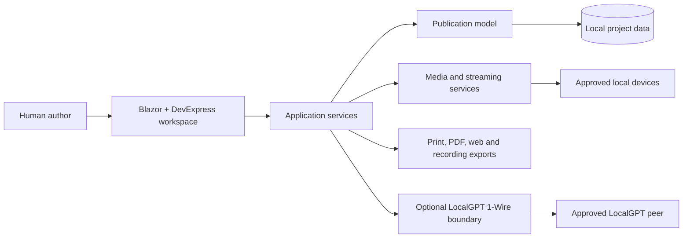

# PublisherStudio documentation

**Version 2.6.8**

PublisherStudio is a local-first publishing workspace for page layout, stories, spreadsheets, pictures, audio, video, streaming, interactive content, and self-contained exports.

This site is the maintained product and architecture documentation. It uses the same documentation shell as LocalGPT, so navigation, search, themes, side rails, and generated API pages behave consistently. 🐾

## Choose a path

### 🌸 Use PublisherStudio

Create a publication, learn the workspace, and understand pages, objects, stories, ribbons, and export workflows.

[Open the user guide](articles/getting-started.md)

### 🎨 Build rich content

Work with stories, spreadsheets, pictures, audio, video, animation, interaction, streaming, and recording.

[Explore pictures and media](articles/pictures-and-media.md)

### 🛠️ Build and maintain it

Read the modular architecture, development requirements, installer behavior, documentation pipeline, and release checks.

[Open engineering guidance](articles/developer-build.md)

### 📚 Look up details

Browse publishing and export behavior, privacy boundaries, the optional LocalGPT connection, and the generated API reference.

[Browse reference material](articles/documentation-system.md)

## Architecture at a glance

The editable publication remains authoritative. Browser runtimes accelerate interaction and rendering, while C# services own project state, validation, persistence, export, and approved external connections.

## Complete documentation set

The conceptual pages are built together with compiler-generated XML documentation for public types and members. The same themed HTML site is shipped inside PublisherStudio and published to GitHub Pages.

The packaged PDF is built from the same reviewed Kawaii HTML tree as the website. It contains every maintained PublisherStudio chapter and every generated API namespace/type page; a tiny source-only or fallback PDF is rejected by the release and Pages gates.

<a class="btn btn-primary" href="PublisherStudio-2.6.8.pdf" download>🐾 Download the Kawaii handbook</a>
